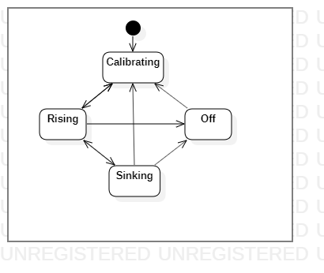
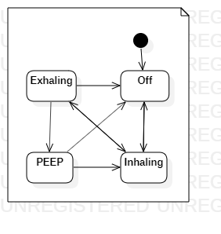

# [SickBay](../../).[respiratory](../)

## Gravity Hookah Ventilator

This folder contains the design files and firmware for the Gravity Hookah Ventilator. You can find the instructions to build this product at <http://pandemiccookbook.org/critical_care/respiratory_care/ventilators/gravity_hookah_ventilator/>.

### Firmware

The best way to program the firmware is using the mbed IDE at <https://os.mbed.com/studio/>. You can find the firmware at <https://os.mbed.com/users/kabukistarship/code/GHVentilator>, where you can also import it into the mbed web-based IDE. We are in need of a Contributor to port the mbed code to Arduino.

The machine operates by updating the GHVentilator x times per second, each time called a Tick. When the machine starts it enters a calibration state that lasts y Ticks. At the end of this process the machine goes directly into the Running state in case of a reset. At any time the machine can get turned off, at which time the machine will need to be recalibrates, which lasts for z seconds. Below is the primary finite state machine diagram.

The GHV can support multiple patients using different breathing inhale and exhale periods and duty cycles. These numbers are represented in Ticks because it simplifies the firmware and makes it more reliable. A positive number of Ticks means that the Channel is in the inhale state for TicksInhale Ticks. A negative number of Ticks means the channel is in the exhale state. At the end of the exhale state we enter the PEEP state, where the Ticks is less than the TicksExhale. In the PEEP State the device checks for w Ticks for the pressure from the Patient's exhale reaches one atmosphere in order for the patient to finish exhaling. The TicksPEEP is the maximum number of ticks the patient will spend in the Exhale state. Below is the Channel finite state machine diagram. From any state, you can go to the off state, but you will always start back at the inhale state.

## How to Contribute

The best way to learn how to contribute to SickBay is to read the Quickstart Guide of the Pandemic Cookbook at <https://pandemiccookbook.org/getting_started/quickstart_guide>.

## License

Copyright © 2020 [Kabuki Starship](https://kabukistarship.com).

This Source Code Form is subject to the terms of the Mozilla Public License, v. 2.0. If a copy of the MPL was not distributed with this file, You can obtain one at <https://mozilla.org/MPL/2.0/>.
