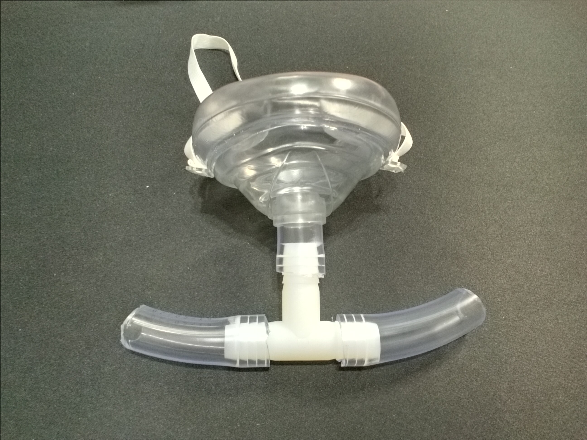

# [pandemic.cookbook](../../../../).[critical_care](../../../).[respiratory](../../).[ventilators](../)

## Gravity Hookah Ventilator

The Gravity Hookah Ventilator is one of the most promising designs because it can be created from commonly available parts found at Home Depot and Amazon, and you can supply clean humidified air for multiple people with one large trashcan and 3 5-gallon buckets, PVC tubes, clear vinyl tubes, CPR masks, a heavy weight, and commonly available electronics.

A Gravity Hookah Ventilator is a type of ventilator that is best described a "gravity bong Hookah with a weight on the bottom". Apologies for the stoner logic, but it's where the design came from. Most people make gravity bongs out of 2-liter bottles of pop with the bottom cut off, with a pipe in the cap. You put the 2-liter in a large bucket, put some pot in the bowl, light a lighter, pull up on the 2-liter, and it fill the cavity with smoke. You then push back down on the bong, and the smoke fills your lungs. To add a water percolator (perc) all you have to do is put a tube on the bottom of the Gravity bong bowl into the water, and when you pull up it pulls the smoke through the water; the technical term for this a Water-percolating Air Pressure Chamber.

The Gravity Hookah Ventilator works almost identically to a water-filtered Gravity bong with CPR masks and oxygen instead of smoke. A Water-percolating Air Pressure Chamber (Pressure chamber) is really useful for making a ventilator because the perc acts as a 1-way air valve that you can rapidly create out of two buckets and some PVC pipes and fittings. You can then control the pressure in the Pressure chamber using an air mattress inflator controlled by an Arduino, an adjustable current power supply, and an I2C Atmospheric pressure sensor to create a PID loop.

A weight is tied onto the bottom of the Pressure chamber, to lower the center of gravity and allows gravity to push the weight down and push the air into the patient's chest, and control the inhale and exhale with 2 solenoids, 1 water flow sensor (because it's an emergency and that's all we have), and 1 I2C atmospheric pressure sensor.

Clear vinyl hose with 7/8 inch outer diameter (OD) and 5/8 inch inner diameter (ID) is uses to connect the pressure chamber to a CPR mask using some Clear vinyl tube with 5/8" inner diameter and 7/8 inch Outer diameter, and you can find this hose at every Home Depot, you just need a 5/8 hose barb Tee to split the air into an inhale and exhale tube.

In order to reduce viral infections, you need to pull the exhale air through a bucket of soapy water and the soap will break the virus down. To support this we can make another module out of 2 5-liter buckets and another air mattress inflater to pull the air through the water the same way we do with the Pressure chamber.

### Bill of Materials

This Bill of Materials (BOM) is meant for a 12 volt 1/2 inch diameter solenoid valve. At Home Depot they only have 24 volt 1 inch diameter Water flow valves, you need to change the pipe coupler diameters and voltage (12V or 24V) to match whatever Solenoid valve you have.

|           Part Name |  Quantity | Part Description |
|--------------------:|:---------:|:-----------------|
|             Buckets |    4      | Standard plastic buckets with lids that can hole about 5-gallons. |
|            Trashcan |    1      | A standard trashcan that can hold over 32-gallons with a lid that you can cut a hold to fit the Bucket through. |
|         Bucket lids |    3      | Lids to attach to the Plastic buckets. |
|         1" PVC pipe |  5 feet   | 1 inch diameter PVC pipe. |
| 1" F-F pipe coupler |    2      | Unthreaded 1" diameter PVC female-to-female couplers. |
|      Solenoid valve |    8      | A 12V 1/2" diameter or 24V 1" diameter water flow solenoid valve. |
|         Flow Sensor |    4      | Some sort of hall-effect water flow sensor, like a YF-S201. |
|         Ball Valve  |    4      | A PBC ball valve; either a 1/2" for 12V or 1" for 24". |
|      1/2" hose barb |    8      | A 1/2 hose barb with 1/2" male threaded connector on the other end. |
|        1/2" ID tube | 40+ feet  | Clear vinyl tube with 1/2" Inner diameter (ID) and 5/8 inch Outer diameter (OD) |
|        5/8" ID tube |  10 feet  | Clear vinyl tube with 5/8" Inner diameter (ID) and 7/8 inch Outer diameter (OD) |
|              Weight |   X KG    | A heavy weight to tie to the bottom of the Pressure chamber bucket. |
|                Rope | X meters  | Rope to tie the weight to the bucket. |
|            CPR Mask |     4     | CPR mask. |
|          Mask strap |     5     | An extra strong strap to hold the CPR mask tight against the patient's head. |
|            Zip ties |     4     | Zip ties to strap the air intake filter to the bucket. |
|        Arduino/mbed |     1     | An Arduino or an mbed microcontroller development board. |
|       Power MOSFETs |     8     | MOSFET power transistors capable of powering 1 solenoid. |
|       Snubber diode |     8     | A diode that can take as much power as the solenoid uses. |
|      10K+ resistors |     8     | Resistors to hook the Power MOSFET up to the solenoids; 10K is the preferred resistance but it doesn't matter. |
|      Ethernet cable | X meters  | Enough cable to hook up the MOSFETs and flow sensors. |
|     Micro USB cable | 3+ meters | A cable to hook the Arduino up to a Laptop. |
|              Laptop |     1     | A laptop to monitor and control the machine. |
|       Active Buzzer |     1     | An active buzzer for when the system needs human operation. |
|   12V Adjustable PS |     1     | A Constant voltage 12v power supply with adjustable current. |
| 12V 2A power supply |     2     | A power supply for an air mattress inflator that under currents the motor so it won't burn out. |
|          Air filter |     1     | An air filter big enough to cover the top of the Bucket lid; DO NOT USE FIBERGLAS FILTERS. |

### Assembly Instructions

#### Pressure Chamber

**1.** Make 2 Straws by cutting about a 15 inch long section of 1 inch PVC pipe and put a 1 inch PVC pipe coupler on top to help hold the straw in place onto the 5-gallon bucket. We will use one of the straws on the inhale input and another to clean the exhale air.

**2.** Cut a 1 inch hole in 3 bucket large enough to fit the straw through the middle of both 5 gallon buckets, put two of 5-gallon buckets but-to-but (usually the bottom when the lid is point up), and put the straw through from one side (doesn't matter which side). Set the other bucket aside for the Exhale filter.

**3.** Drill for holes in next to the lid of the bucket and tie a metal weight to it such that the weight hangs down at the bottom of the trash can when the unit is off. This will put the center of gravity bellow force in the bucket pulling it up, improving stability similar to holding a ballon verses standing on one. Please note,this is a 5 pound weight, I don't know what weight right, plan for a 25, 35, or 45 pound metal weight.

**4.** Attach the air mattress inflater by putting some electrical tape around the blower end of the inflater so it fits air tight in the Straw by cutting about a 1 1/2 inch section of the 1 inch PCV pipe and putting in the other side of the 1 inch coupler and putting the air mattress inflater in the 1 1/2 inch pipe and the 1 1/2 pipe into the 1 inch coupler.

**5.** Attach the YS-201 water flows sensors to the solenoids using a 1/2 inch male-to-male ball valve such that the arrows are pointing the same direction and the solenoid comes first. Please note in this picture I am missing 2 solenoids so there are only 2 here because I can still test the firmware with this configuration.

**6.** Cut the 10 foot 5/8 inch OD hose 4 ways, wrap one end in electrical tape, and screw the 1/2 female-to-female coupler to the hose.

**7.** Drill holes in the 5-gallon buckets such that you can push the male-to-male coupler in the solenoid through both sides.

**8.** Push the male-to-male coupler attached to the solenoid (note: not the flow sensor) through the holes from the previous step and screw on the 1/2 inch threaded female-to-female coupler to screw the solenoid onto the bucket. Please note again there are only 2 solenoids here when there should be 4 because I don't have the parts yet.

**9.** Cut a hole in the lid of the trashcan just large enough to stick the lid-side of the 5-gallon bucket through it, and put it on the trashcan.

**10.** Make an air filter for the air intake by cutting a hole in the top of two 5-gallon bucket lids, cutting out the inside of one of the bucket lids about 3 inches wider, drill some holes to slip some zip ties through, and zip tying the cut out lid to the bucket lid with only 1 hole in it, and zip tie them together.

#### Exhale Filter

**11.** Inside of the extra bucket we cut a 1 inch hole into in Step 2, cut one 5/8 inch hole for each solenoid through the bottom of the side of the bucket about 2 inches from the bottom. We're going to put our solenoid though here and we want the heavy magnet to hang bellow to make a more stable center of gravity. Through the hole, screw a 1/2" nipple into the 1/2 inch female-to-female coupler, screw a 1/2 inch diameter 1 inch long male-to-male coupler in the other end, and screw the nipples and couplers on the outside to the solenoids on the inside of the bucket. Make sure to line up the arrow of the solenoid facing into the bucket.

**12.** Put some electrical tape on the blower end of the matrass inflater and put it in the Straw.

**13.** Cut a 1 inch hole into the lid of a bucket, and drill holes around the inside of the rim for the air to air to vent back out, attach the lid to the bottom of the bucket from the previous step, fill the bucket with no holes in it full of soapy water, and put the bucket, straw, and lid on the bucket with the soapy water.

x

#### Mask

**14.** Cut two 2 inch sections of 7/8 OD 5/8 ID hose,attach them to both ends of the Tee, cut another 1 1/2 inch section, attach it from the Tee to the CPR mask, and hook the hoses up from the Inhale Compressor and the Exhale Filter.

**15.** make a strap for the Mask that allows the CPR mask to fit with a good seal around the mouth.

#### Electronics

**16.** Wire the electronics according to the Electrical schematic at <https://github.com/kabukistarship/sickbay/raw/master/respiratory/ventilators/ventilator.gravity_hookah/ventilator.gravity_hookah.electrical_schematic.pdf>.

**17.** Download and program mbed or Arduino firmware at <https://github.com/kabukistarship/sickbay/tree/master/respiratory/ventilators/ventilator.gravity_hookah>.

**[<< Previous Section: Ventilators](../) | [Next Section: Bag-Valve-Mask Ventilator >>](../bag-valve-mask_ventilator)**

## How to Contribute

The instructions for how to contribute to the cookbook on GitHub are in the [Quickstart Guide](../../../GettingStarted/QuickstartGuide) in the Getting Started Chapter You can contribute financially to provide free Pandemic ventilators for people in need at <https://cookingwithcale.org/projects>.

## Health Care Advisory Warning

This cookbook is not intended to replace a professional doctor or medical equipment and you are advised to seek professional medical assistance until your local healthcare system gets overwhelmed. The intention of this cookbook is to serve as an emergency manual on how to survive the pandemic and save lives when you don't have access to a Hospital.

## License

Copyright 2020 © [Kabuki Starship](https://kabukistarship.com).

This Source Code Form is subject to the terms of the Mozilla Public License, v. 2.0. If a copy of the MPL was not distributed with this file, You can obtain one at <https://mozilla.org/MPL/2.0/>.
